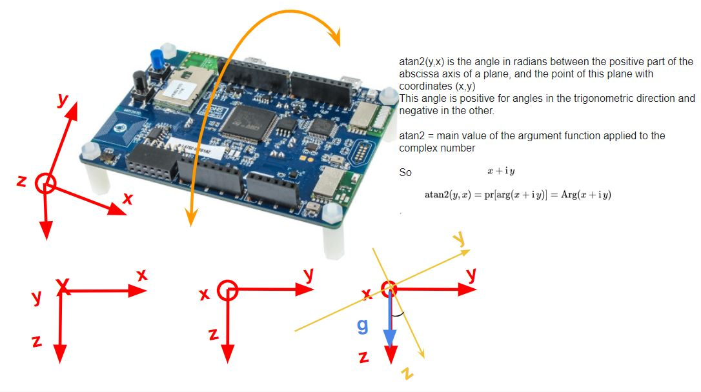
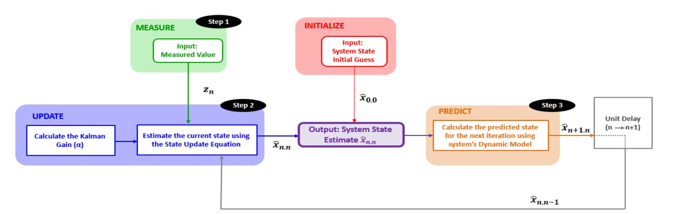

# VTOL control system

## Summary 
This project was conducted in a group of four people where each one took care of a specific part. 
We conducted a theoretical research which then converged towards an increasingly practical approach by testing the system on a real prototype. To create and control a VTOL system, the first task was to keep our aircraft prototype stable and in balance (0 degrees relative to the roll axis). Our system regains its horizontal position after any disturbance applied to it in order to guarantee the verticality of take-off and landing. The feedback of our system was calculated from the data collected by the sensors : 3D accelerometer and 3D gyroscope (LSM6DSL), then fused by the Kalman filter.
  
## Theoritical Study
The aircraft systems were studied to understand flight control and the physics behind it. We analysed the stability of these complex systems. Then a comparative study between conventional aircrafts and Vertical Take-Off and Landing Systems.
  
## Actuators and Sensors
We studied the linearity of DC motors and most importantly the sensors needed, how they work and how to calculate the correct position. 
  
### Position Calculations:  

  

Two MEMs sensors were used:   
- Accelerometer   
- Gyroscope  
Calibration was needed and filters were added, specifically the Kalman filter to insure data fusion.  

#### Kalman filter
The kalman filter numerical implementation was thouroughly studied, but to decrease the complexity of the project, we abstract the mathematical details and we use it as a black box to filter the noise emanating from the measured angle.  

  

#### STM32 Board used: 
The sensors data acquisition and processing were done on the *IOT-node*: STM32L4 Discovery Kit. [link](https://www.st.com/en/evaluation-tools/b-l475e-iot01a.html)  
The choice of board is made for several reasons:  
  1- The presence of sensors embedded on the board (Accelerometer, Gyroscope and Magnetometer)  
  2- The presence of an STM32L475 microcontroller known for its low consumption therefore suitable for autonomous drones.  
  3- The presence of wireless communication modules for future improvements. (WIFI or Bluetooth)  

## Full report:
The report was written in French and it includes all the parts of the project conducted in a group of four people: Khalil Kaanich, Taher Bazzazi, Imed Ben Slimene and myself.
[link](https://github.com/mariambeji/MyPortfolio/blob/23ef879339783d285c5ebb871ff4409a22ba0739/Vertical%20take-off%20and%20landing%20system/VTOL-report.pdf)  

## Contact Information
If you would like to learn more about this project or get in touch with me, please feel free to do so through the following channels:
- [LinkedIn](https://www.linkedin.com/in/mariam-beji-90ab28178/)
- Email: mariambeji@ieee.org

